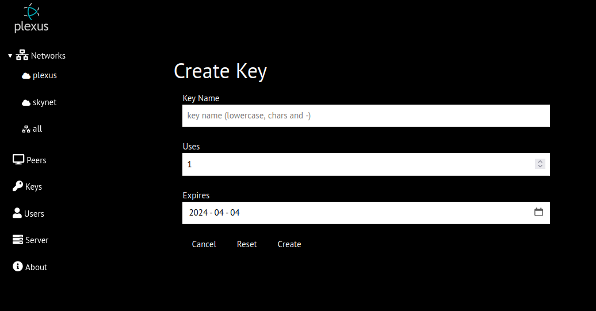

# Keys
Keys are used for agent registration with the server

Selecting the key name will copy the key to the clipboard
## Key Creation
Keys creation requires
* key name - up to 255 chars (lower case and - char only)
* key usage (defaults to 1) - key will be deleted when usage drops to zero
* key expiry date (defaults to today) - key will be deleted after expiry date

## Key Deletion
* manually (from key details)
* automatic (which ever occurs first)
    * key usage drops to zero
    * key expiration date has passed