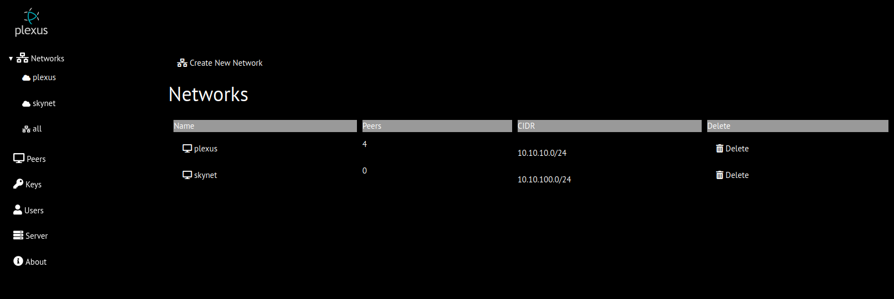
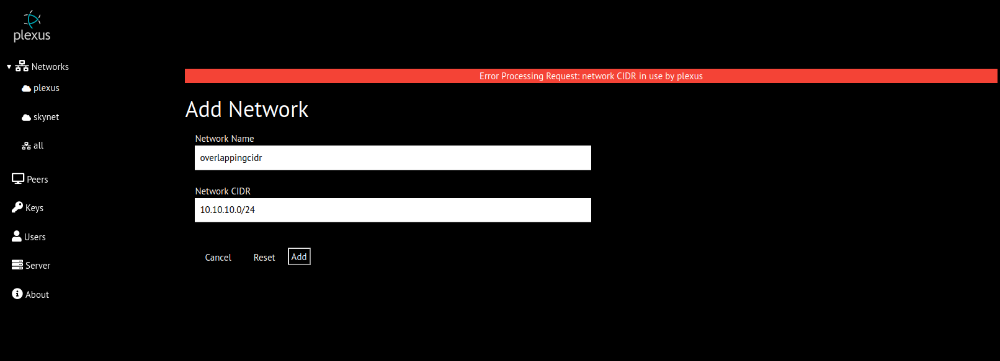
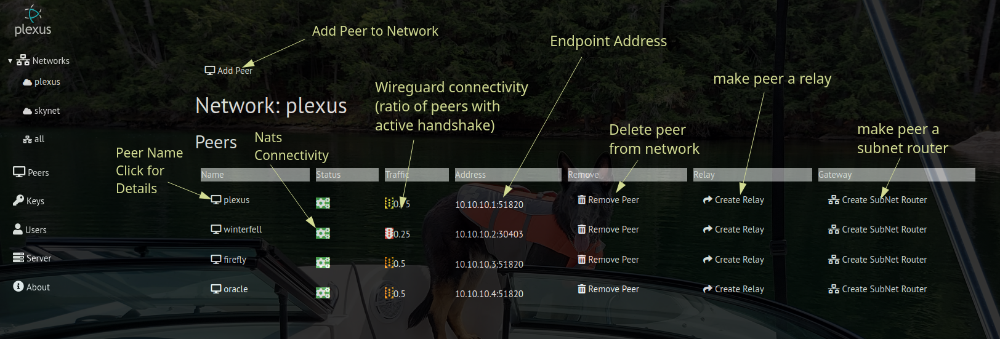

Networks
--------
The main network page displays a listing of all networks and the abiltity to create new or delete existing networks

## Create New Network

To add a new network, the network name and network CIDR must be specified.  The network name is limited to 255 characters consisting of lowercase letters, numerals and hypen. 
The network CIDR is normalazed (eg. your can enter 10.10.11.25/20 and it will be normalized to 10.10.0.0/20).  Network names and CIDRs are checked against existing networks for overlap.
## Delete Network
Clicking the delete network button will present a confirmation prompt.  If confirmed, the network will be deleted and all peers will be notified.

## Network Details

The network details pages displays all peers in current network and a button to add a new peer to the network.  Selecting the new peer button will display a modal dialog that contains a listing (name, endpoint and connection status) of all peers not in current network. Selecting a peer will add it to the network unless the peer is not connected.

For each peer, the following data and controls are displayed

| Heading | Detail |
| --- | ---- |
| Name | Selecting the peer name will display [addtional details](peers.md) |
| Status | Indicator (green/red) of nats connectivity between server and peer |
| Traffic | Indicator (green/yellow/orange/red) of wireguard connectivity |
| Address | network IP and wireguard listen port |
| Remove | Button (with confirmation) to delete peer from network |
| Relay | Relay status and button to create/delete [relay](relays.md) |
| Gateway | Button to create/delete [subnet router](routers.md:) |
