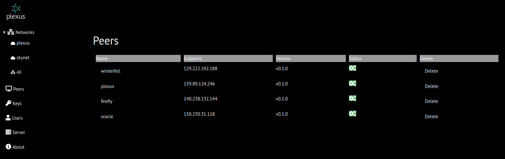
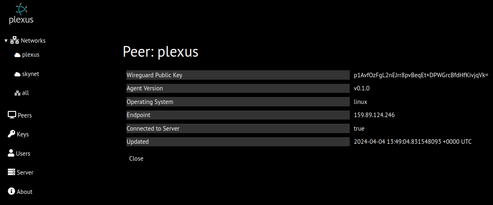
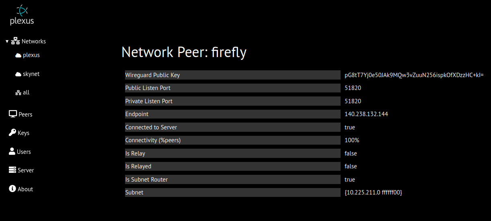

# Peers
## Server Peers
All peers registered with server are displayed
* name - selecting peer name will display additional details
* endpoint
* agent version
* nats connectivity status indicator (green/red)
* delete button (with confirmation) to delete peer from server

## Server Peer Details
Details:
* Wireguard Public Key
* Agent Version
* Operating System
* Endpoint
* Nats connectivity
* Time of last update 

## Network Peers
Displays details about a network peer
* Wireguard Public Key
* Wireguard Public Listen Port
* Wireguard Private Listen Port
* Endpoint
* Nats connectivity
* Relay Status
* Relayed Status
* Subnet Router Status
* Subnet (only displayed if peer is subnet router)

