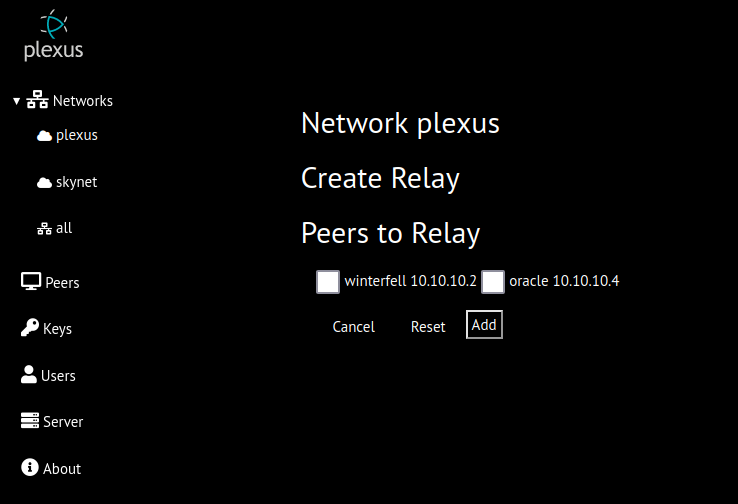

# Relays
Relays are useful when peers have difficulty communicating (eg. peers are behind restrictive NAT)
When relayed, all wireguard communications to/from the peer will be relayed by the relay peer.
For example, if peer A is relayed by peer B,  wireguard communications between peers A and C will be forwarded by peer B. A->B->C and C->B-A.
## Relay Creation
On the network details page, select the create relay button for the peer to be the relay. The create relay page will be displayed containing a list a eligible peers to be relayed. 
Any peer can be selected as the relay but it is not recomended to select that is behind NAT (public listen port and private listen port differ).

### Eligible Peers to be Relayed
Peers cannot be relayed if:
* are they are a relay
* are being relayed by another peer
* are a subnet router  (restriction may be removed in future)
## Relay Deletion
On the network details page, select the Delete Relay button. 