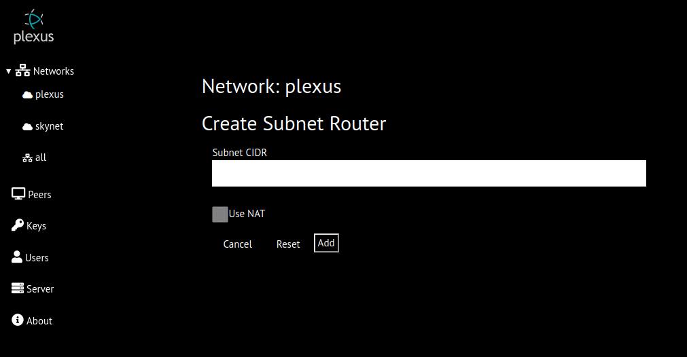

# Subnet Routers
Subnet routers permit access to hosts via wireguard without installing plexus-agent or wireguard on the host.  A common use case is to enable access to a home lan from a road warrior setup.
Wireguard and plexus-agent are installed on a host inside the home lan and on the road-warrior computer and both peers are connected on a plexus wireguard network.  A subnet router is created on 
the home lan peer with the subnet cidr set to the cidr of the home network.  The road-warrior machine can then connect to any host on the home lan.

## Caveates 
In order for sunet routing to function correctly
* the subnet router must have ip_forwarding enabled; and
* the subnet router must be the default gateway for the lan; or
* all hosts on the lan have a static route for the wireguard network via the subnet router peer; or
* NAT is enabled; and
* subnet cidr does not overlap with
    * a wireguard network that router peer is connected to
    * another subnet cidr on the same wireguard network
    * local lan of plexus peer

The later restriction can be circumvented with virtual subnets describe below

## NAT
> this capability is not yet implemented

NAT is enabled by selecting the NAT checkbox on the Create Subnet Router page.  Network Address Translation (NAT) will be applied to traffic to/from the subnet by the subnet router.
This eliminates the need for the subnet router to be the default gateway for the lan or to provide hosts on lan with a static route.

### Virtual Subnet
> this capability is not yet implemented

Virtural subnets overcome two potential issues with subnet routers
* creating two subnet routers on same network where the lan subnets are overlapping
* connecting to a subnet via a subnet router but the lan subnet overlaps with the local address of the peer. EG. road-warrior at internet cafe with local address of 192.168.1.305 trying to connect to a
 subnet routed host 192.168.1.209 

With a virtual subnet, peers connect to the real subnet hosts by specifying a virtual subnet address. For example, the real subnet is 192.168.0.1/24.  A virtual subnet is created, eg. 192.168.100.0/24.
If peer A want to connect to the web server at 192.168.0.101 they would use 192.168.100.101 and the subnet router would route the packets correctly.
