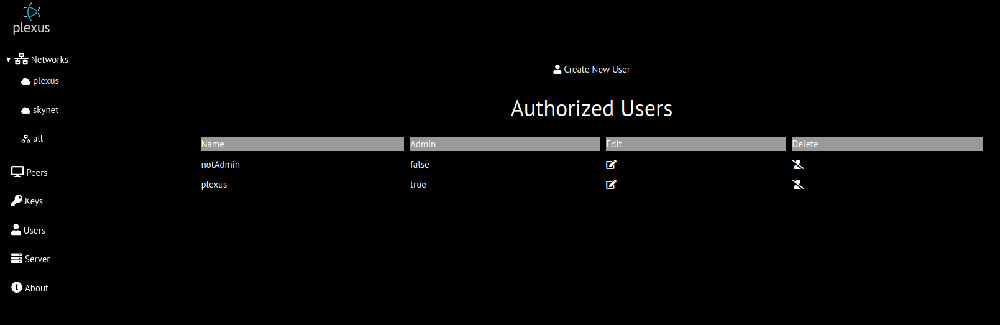
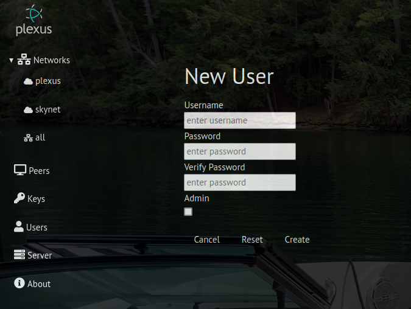
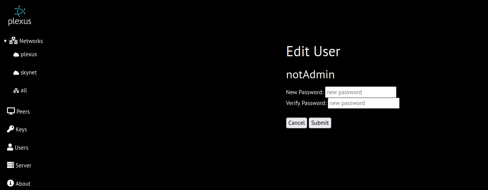

# Users
The user page displays different information for admin and non-admin users
## Admin User

displays the user details page where admin can:
* create new users
* delete existing users
* edit (change password) of existing users
### Create New User

## Non Admin User
displays the edit/password update page

